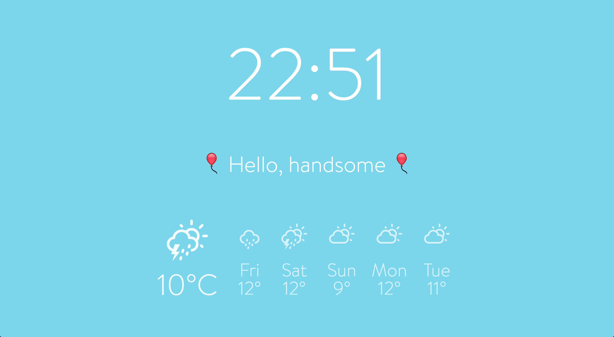

# limbali-dash
A simple JS dashboard for current location's info - time, weather and a short message.

Updates time every minute (how convenient!) and weather every 15 minutes which should be fine.

# Setup

Use node >= 5

Start with `npm start`
A browser should open on [http://localhost:1337/](http://localhost:1337/)

# Deployment
You can simply serve this trough any webserver as a static site.
Alternativley you can use the builtin gulp-connect server with gulp serve-prod which will start a webserver on port 8080
